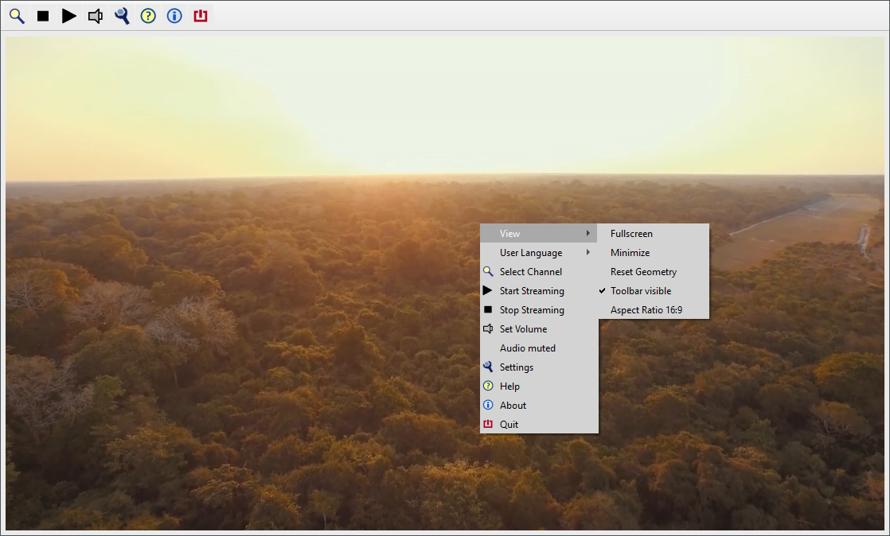

<H1>CyberTelly Qt</H1>

Mediaplayer for TVHeadend and M3u Playlists 

[Seite anzeigen auf Deutsch](./README.md) 

 
Download setup binaries for Windows, Linux x64, Raspberry Pi OS: [releases](https://github.com/rkm-r/CyberTelly/releases)

<H2>The Essentials in a Nutshell:</H2> 
CyberTelly is free software for watching TV on Windows or Linux PCs. It has two ways of receiving video streams: 
<ol>
<li>TVHeadend: If you have a TVHServer in your local network it can be used as a source for live TV and EPG.</li>
<li>M3u Playlists: They can contain addresses of publicly available IPTV streams on the internet or channel information of a locally installed Sat-IP server / FritzBox Cable.</li>
</ol>
Getting started is very easy:
<ol>
  <li>Download setup file; see link above</li>
  <li>Install program</li>
  <li>Give it a try ...</li>
</ol>
CyberTelly comes with a preinstalled m3u playlist of freely available (mostly German) IPTV channels. It should be possible to watch TV without any further configuration.  
Please note: 
<ul>
<li>IPTV only works with a stable internet bandwidth! Please check bandwidth if you are not sure, e.g. with nperf.com</li>
<li>Linux users must be aware, that the program needs X11 as session type. Wayland is not supported!</li>
<li>Users from countries outside Germany may experience geo blocking issues when trying to stream a German channel. May be it will be necessary to download a m3u list from https://github.com/iptv-org/iptv</li>
</ul>

Basic hints on how to use the program see [picture gallery with comments.](./docs/Gallery.md) 

For detailed information see [user manual.](./docs/User-Manual.md)
