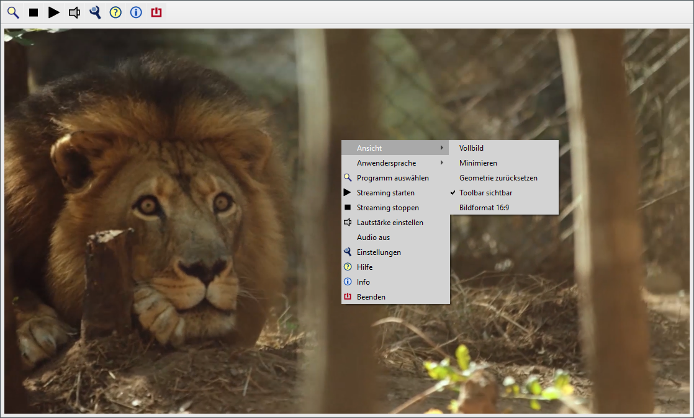

[Show page in English](./README-en.md) 

<H1>CyberTelly Qt</H1>
Mediaplayer für TVHeadend und M3u-Playlists 

 
Downloads für Windows, Linux x64, Raspberry Pi OS siehe [releases](https://github.com/rkm-r/CyberTelly/releases)

<H2>Alles Wesentliche auf einen Blick:</H2> 
CyberTelly ist ein frei verfügbares Programm zum Fernsehen am Windows- oder Linux-PC. Es beinhaltet zwei Arten des Fernsehempfangs: 
<ol>
<li>TVHeadend: Wenn im lokalen Netzwerk ein TVHServer vorhanden ist, kann er als Quelle für Live-TV und EPG verwendet werden.</li>
<li>M3u-Playlists: Damit kann man frei im Internet verfügbare IPTV-Sender streamen oder einen Sat>IP-Server bzw. eine FritzBox Cable im lokalen Netzwerk als TV-Quelle benutzen.</li>
</ol>
Der Start ins Fernsehvergnügen ist sehr einfach:
<ol>
  <li>Setup-Datei herunterladen; Link sie oben</li>
  <li>Programm installieren</li>
  <li>Loslegen ...</li>
</ol>
Nach dem Setup ist eine M3u-Playlist mit frei verfügbaren (hauptsächlich deutschen) IPTV-Sendern vorinstalliert. CyberTelly kann ohne weitere Konfiguration sofort ausprobiert werden.  
Bitte beachten: 
<ul>
<li>IPTV benötigt eine stabile Internet-Bandbreite! Bitte die Bandbreite im Zweifelsfall prüfen, z.B. mit nperf.de.</li>
<li>Unter Linux funktioniert das Programm nur mit Session Type X11. Wayland wird nicht unterstützt!</li>
<li>Geoblocking kann die Anzeige deutscher Sender in Österreich oder der Schweiz verhindern. Eine passende M3u-Playlist ist zu finden unter https://github.com/jnk22/kodinerds-iptv</li>
</ul>

Tipps zur Bedienung des Programms siehe [bebilderte Beschreibung.](./docs/Galerie.md) 

Detaillierte Informationen zum Programm siehe [Benutzer-Handbuch.](./docs/Benutzerhandbuch.md)

