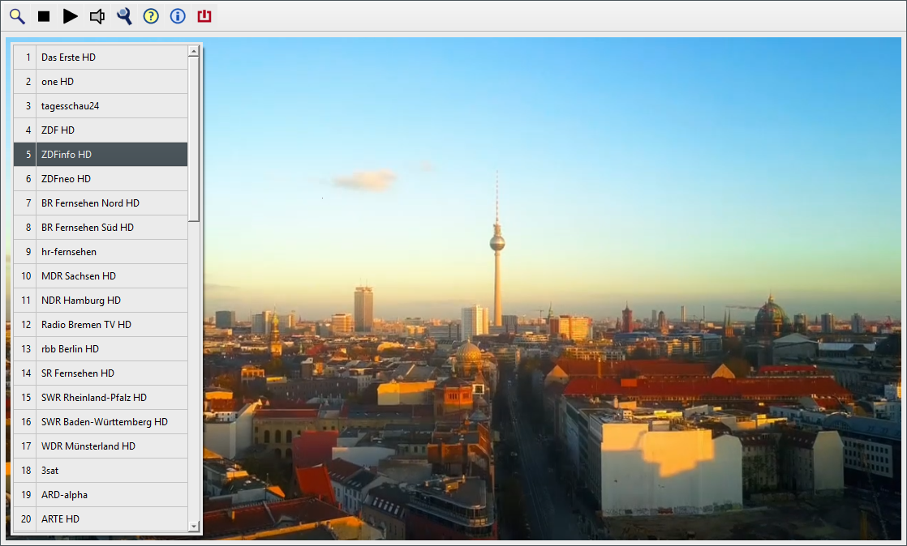
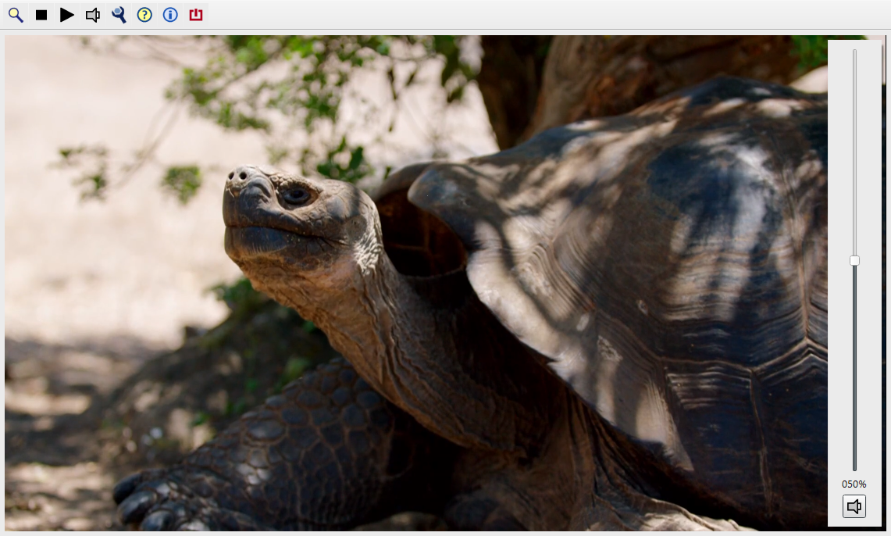

[Gehe zurück](../README.md) 

# CyberTelly - Screenshots mit Kommentaren

 
Ansicht: Geöffnetes Kontextmenü 
Kontextmenü kann mit Rechtsklick geöffnet werden.

 
Ansicht: Geöffnetes Programmauswahl-Fenster 
Kontextmenü: Programm auswählen 
Start eines Videostreams mit Doppelklick oder Return-Taste.

 
Ansicht: Geöffneter Lautstärke-Regler 
Lautstärkeregelung mit Mausrad oder Pfeil nach oben/unten. 
Popup öffnet sich automatisch nach Maus- oder Tasten-Ereignis.
