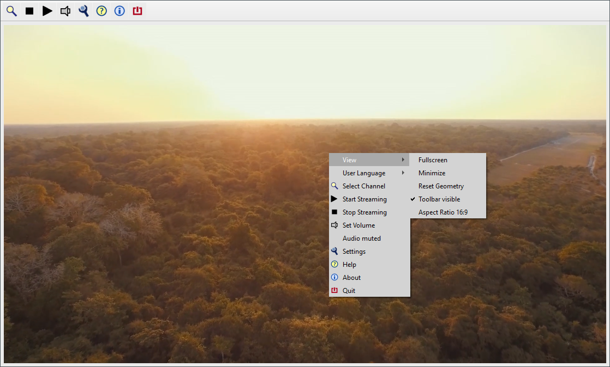
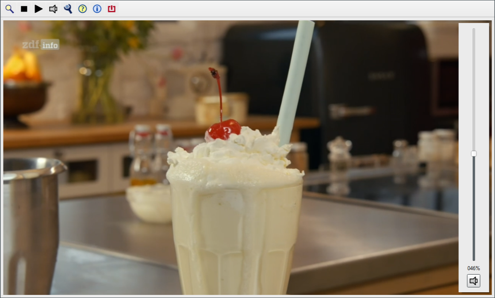

[Go back](../README-en.md) 

# CyberTelly Qt - Screen shots with comments

 
View: Context Menu 
Click right mouse button to open context menu.

 
View: Channel List 
Context menu: Select Channel 
Doubleclick left mouse button or press Enter key to start streaming.

 
View: Volume Control 
Mouse wheel or arrow up/down keys set audio volume. 
Popup opens automatically after mouse or keyboard event.
